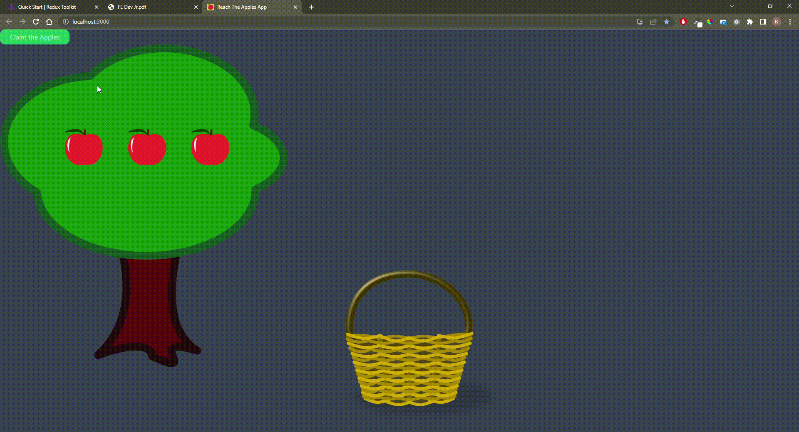

# Welcome to Claim The Apples App

To reach the apples on the tree, you can click on the tree or button to make the apples fall. After clicking on the tree, it will shake for three seconds and then drop its fruits. After staying on the ground for one second, they will enter the basket.

[Live Demo](https://reach-apples.vercel.app/)

## Available Scripts

Run `npm install` or `yarn` to install dependencies

Run `npm start` or `yarn start` to start Web App

## Usage of Technologies

- React JS
- Redux, Redux Toolkit

## UI Libraries

- TailwindCSS

